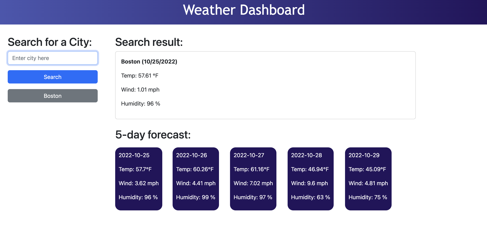

# today-s-weather-is

## Description

In this project, I made a forecast report by city name. Start code was not given for html/stylesheet, and have to build from scratch.

As a user searches the city, there will be two results: same-day forecast and 5-days forecast.

## Screenshot

## Deployed application link
https://d0kd0.github.io/today-s-weather-is/
